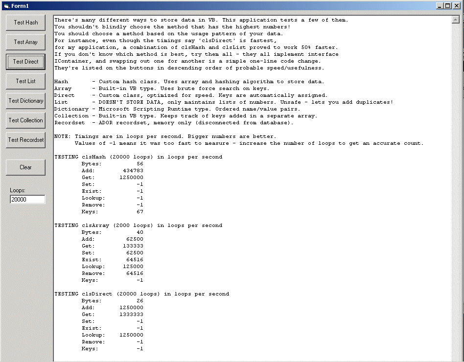



## Container Speed Testing \- Hash, Array, Direct, List, Dictionary, Collection, Recordset

### Description

There's many different ways to store data in VB. This application tests a few of them. You shouldn't blindly choose the method that has the highest numbers! You should choose a method based on the usage pattern of your data. For instance, even though the timings say 'clsDirect' is fastest, for my application, a combination of clsHash and clsList proved to work 50% faster. If you don't know which method is best, try them all - they all implement interface IContainer, and swapping out one for another is a simple one-line code change.
 
### More Info
 

             |
---                |---
**Submitted On**   |2003-10-24 22:09:42
**By**             |[Kamilche](https://github.com/Planet-Source-Code/PSCIndex/blob/master/ByAuthor/kamilche.md)
**Level**          |Intermediate
**User Rating**    |5.0 (15 globes from 3 users)
**Compatibility**  |VB 6\.0
**Category**       |[Miscellaneous](https://github.com/Planet-Source-Code/PSCIndex/blob/master/ByCategory/miscellaneous__1-1.md)
**World**          |[Visual Basic](https://github.com/Planet-Source-Code/PSCIndex/blob/master/ByWorld/visual-basic.md)
**Archive File**   |[Container\_16630610252003\.zip](https://github.com/Planet-Source-Code/kamilche-container-speed-testing-hash-array-direct-list-dictionary-collection-recordset__1-49432/archive/master.zip)

